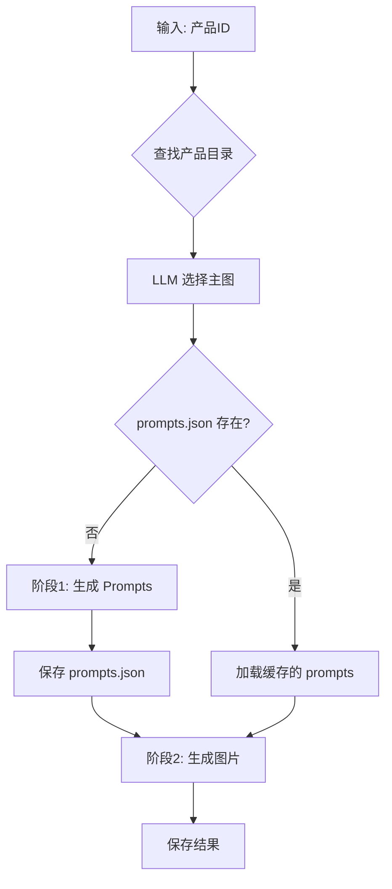

# ecom

AI-powered product image generation for e-commerce.

## Setup

```bash
# Copy product catalog
cp -r "新格率免费体验精选品" catalog

# Install & configure
uv sync && source .venv/bin/activate
export GEMINI_API_KEY='...'
```

## Usage

```bash
python gemini_image.py -p PRODUCT_ID [-n NUM] [--model MODEL]
```

## Options

| Flag | Description |
|------|-------------|
| `-p` | Product ID (from `catalog/`) |
| `-i` | Direct image path |
| `-n` | Limit generated images |
| `--model` | `gemini` \| `gemini-3` \| `imagen` \| `imagen-ultra` |

## Pipeline



## Output

```
outputs/{product_id}/
├── prompts.json           # Cached prompts
└── {timestamp}/
    ├── reference.jpg
    ├── results.json
    └── *.jpg
```
