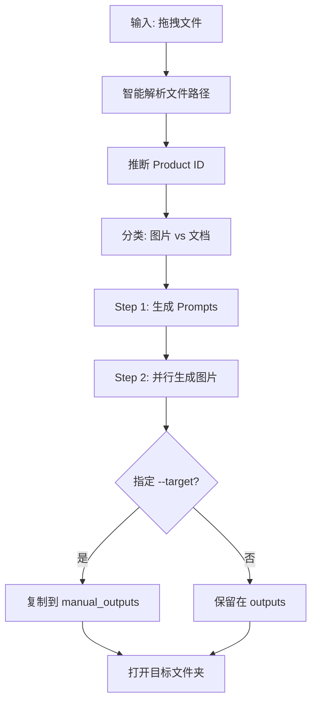

# ecom

AI-powered product image generation for e-commerce using Gemini.

## Setup

```bash
# Install dependencies
uv sync

# Set API key (add to .zshrc for persistence)
export GEMINI_API_KEY='your-api-key'
```

## Usage

```bash
# 直接拖拽多个文件到终端（自动解析，无需空格分隔）
uv run python gemini_image.py --mode top [拖拽文件]

# 指定目标文件夹，完成后复制到 manual_outputs/<target>/<task_id>
uv run python gemini_image.py --mode top -t 假发 [拖拽文件]

# 主图模式 (默认)
uv run python gemini_image.py catalog/PRODUCT_ID/image.jpg

# 预览图模式
uv run python gemini_image.py --mode preview catalog/PRODUCT_ID/image.jpg

# 色彩适配模式 (目标图 + N个产品图)
uv run python gemini_image.py --mode adapt [目标图] [产品图1] [产品图2] ...
```

## Options

| Flag | Description |
|------|-------------|
| `--mode` | `cover` / `preview` / `top` / `adapt`. Default: `cover` |
| `-m, --model` | `gemini` \| `gemini-3` \| `imagen` \| `imagen-ultra`. Default: `gemini-3` |
| `-t, --target` | 复制结果到 `manual_outputs/<target>/<task_id>` |
| `--no-open` | Don't open output folder in Finder after completion |

## Modes

| Mode | Description | Output |
|------|-------------|--------|
| `cover` | 主图 - 创意风格，可变化 | 10张 |
| `preview` | 预览图 - 写实还原，严格匹配 | 10张 |
| `top` | 全套11张 - 电商详情页完整方案 | 11张 |
| `adapt` | 色彩适配 - 目标图构图 + 产品图颜色 | N张 (每个产品色1张) |

### Top Mode (全套11张)

1. 封面图 (Hero Shot) - 多色全展示
2. 购物车预览图 (Cart Preview) - 单色白底
3. 量大管饱图 (Abundance Shot) - 数量感
4. 尺寸对比图 (Size Comparison)
5. 场景对比图 (Before/After)
6. 沉浸式场景图 (Lifestyle)
7. 痛点/解决方案图 (Pain/Solution)
8. 核心卖点可视化 (USP)
9. 特写/细节图 (Close-up)
10. 规格/多合一展示 (What you get)
11. 使用步骤 (How-to)

### Adapt Mode (色彩适配)

输入: 1张目标图 + N张产品图
输出: N张适配图 (目标图构图 + 各产品图颜色)

## Pipeline



## Supported Files

| Type | Extension | Note |
|------|-----------|------|
| Image | `.jpg` `.png` `.webp` `.gif` `.bmp` | 支持多张 |
| Document | `.pdf` `.txt` `.md` | 直接上传 |
| Document | `.docx` `.doc` `.xlsx` `.pptx` | 自动转换 |

## Output Structure

```
outputs/{product_id}/{mode}/{task_id}/
├── prompts.json          # 生成的 prompts
├── analysis.txt          # 产品分析 (top mode)
├── reference*.jpg        # 参考图
├── results.json          # 完整结果
└── 01_*.jpg ... N_*.jpg  # 生成的图片

manual_outputs/{target}/{task_id}/
└── (同上，--target 指定时复制到此)
```

## Prompt Templates

Located in `prompts/` folder:
- `cover.txt` - 主图 prompt (创意风格)
- `preview.txt` - 预览图 prompt (写实还原)
- `top.txt` - 全套11张 prompt (V4.2 Multi-Color Edition)
- `adapt.txt` - 色彩适配 prompt

## Similarity Check

Compare image embeddings using CLIP model.

```bash
# All pairs
python test_similarity.py similarity_tests/my_folder/

# Target mode (compare one vs others)
python test_similarity.py similarity_tests/my_folder/ -t target.jpg
```
