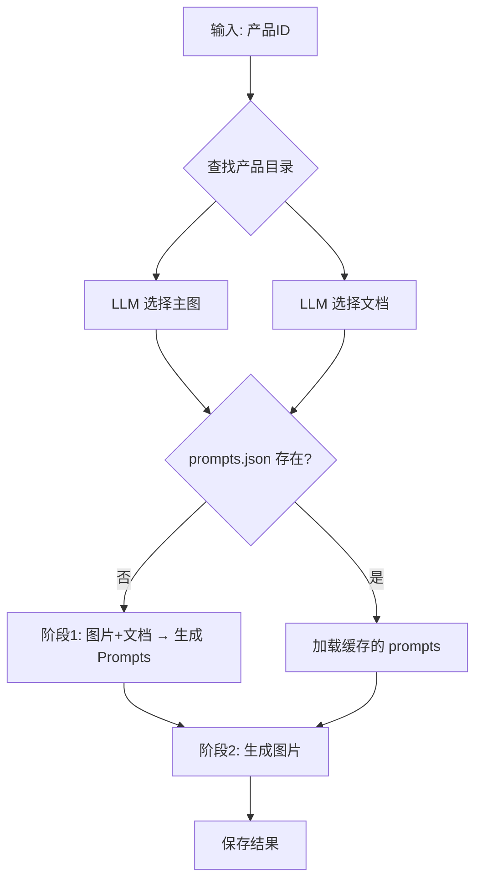

# ecom

AI-powered product image generation for e-commerce.

## Setup

```bash
# Copy product catalog
cp -r "新格率免费体验精选品" catalog

# Install & configure
uv sync && source .venv/bin/activate
export GEMINI_API_KEY='...'
```

## Usage

```bash
python gemini_image.py -p PRODUCT_ID [-n NUM] [--model MODEL]
```

## Options

| Flag | Description |
|------|-------------|
| `-p` | Product ID (from `catalog/`) |
| `-i` | Direct image path |
| `-n` | Limit generated images |
| `--model` | `gemini` \| `gemini-3` \| `imagen` \| `imagen-ultra` |

## Pipeline



## Supported Files

| Type | Extension | Note |
|------|-----------|------|
| Image | `.jpg` `.png` `.webp` `.gif` | LLM auto-selects main image |
| Document | `.pdf` `.txt` | Direct upload |
| Document | `.docx` `.doc` | Auto-convert to PDF |

## Output

```
outputs/{product_id}/
├── prompts.json           # Cached prompts
└── {timestamp}/
    ├── reference.jpg
    ├── results.json
    └── *.jpg
```

## Similarity Check

Compare image embeddings using CLIP model.

```bash
# All pairs
python test_similarity.py similarity_tests/my_folder/

# Target mode (compare one vs others)
python test_similarity.py similarity_tests/my_folder/ -t target.jpg
```

Test images go in `similarity_tests/` (gitignored).
